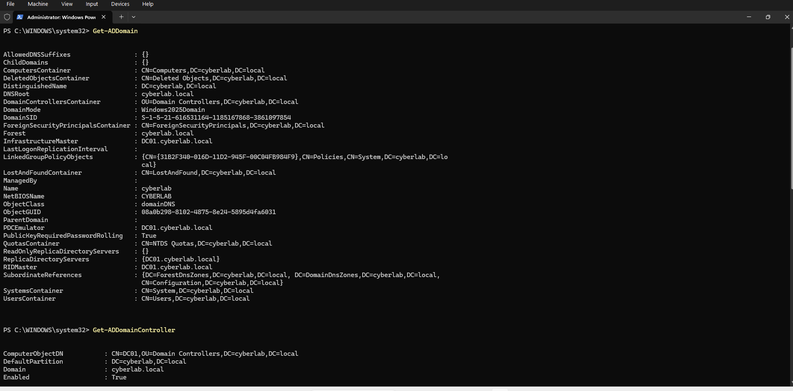
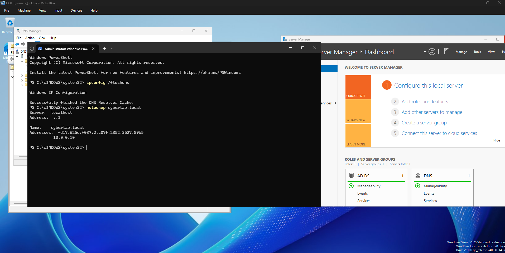

# Phase 2 - Active Directory Domain Services

## Overview

The second phase of the cybersecurity home lab focused on deploying Microsoft Active Directory Domain Services (AD DS) and configuring DC01 as the first domain controller in the environment.

Active Directory provides centralized authentication and management for users, computers, groups, and security policies within the lab.

## Active Directory Deployment

The Active Directory Domain Services role was installed on the Windows Server 2025 system named `DC01`.

After installing the AD DS role, DC01 was promoted to a domain controller and a new Active Directory forest was created.

### Domain Configuration

| Setting | Configuration |
|---|---|
| Domain Controller | DC01 |
| Root Domain | cyberlab.local |
| NetBIOS Domain Name | CYBERLAB |
| Forest Functional Level | Windows Server 2025 |
| Domain Functional Level | Windows Server 2025 |
| DNS Server | Enabled |
| Global Catalog | Enabled |
| Read-Only Domain Controller | Disabled |

The lab currently contains a single Active Directory forest with one domain:

`cyberlab.local`

DC01 serves as the first domain controller for the environment.

## DNS Integration

DNS was installed as part of the domain controller deployment.

Active Directory relies on DNS to allow clients and services to locate domain controllers and other domain resources.

The internal CYBER-LAB interface on DC01 uses the following static IPv4 configuration:

- IP Address: `10.0.0.10`
- Subnet: `10.0.0.0/24`
- Subnet Mask: `255.255.255.0`

Future domain-joined systems in the CYBER-LAB network will use DC01 for Active Directory DNS resolution.

## Active Directory Verification

After promotion, the Active Directory environment was verified using PowerShell.

The following command was used to retrieve information about the domain:

`Get-ADDomain`

The output confirmed:

- DNS root: `cyberlab.local`
- NetBIOS name: `CYBERLAB`
- Domain mode: Windows Server 2025

The domain controller was verified using:

`Get-ADDomainController`

The results confirmed that `DC01.cyberlab.local` was operating as a domain controller and Global Catalog server.

## Service Verification

The status of the Active Directory Domain Services and DNS services was checked using:

`Get-Service NTDS,DNS`

Both services returned a status of:

`Running`

This confirmed that the core Active Directory and DNS services were operational.

## DNS Resolution Testing

DNS resolution for the Active Directory domain was tested using:

`nslookup cyberlab.local`

The domain successfully resolved through the DNS service running on DC01.

## Current Environment

At this stage, the lab architecture consists of:

Internet  
│  
VirtualBox NAT  
│  
DC01  
├── NAT-INTERNET  
└── CYBER-LAB - 10.0.0.10/24  
&nbsp;&nbsp;&nbsp;&nbsp;│  
&nbsp;&nbsp;&nbsp;&nbsp;└── cyberlab.local

Future phases will introduce domain users, organizational units, security groups, Group Policy, and a Windows client workstation.

## DNS Troubleshooting

During validation, the NAT interface on DC01 registered its dynamically assigned `10.0.2.15` address in the Active Directory DNS zone in addition to the intended internal address of `10.0.0.10`.

Because domain clients should communicate with the domain controller through the isolated CYBER-LAB network, DNS registration was disabled on the `NAT-INTERNET` interface.

The stale `10.0.2.15` Host (A) record was then removed from the `cyberlab.local` DNS zone.

DNS resolution was verified again using:

`nslookup cyberlab.local`

The final configuration successfully resolved the domain using the internal `10.0.0.10` address.

## Evidence

### Active Directory Domain

### DNS Verification

